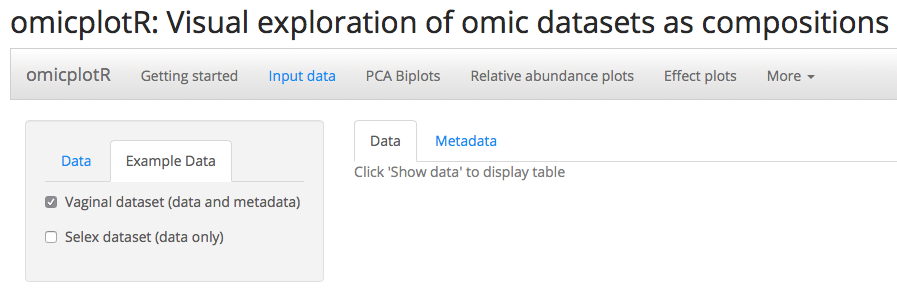
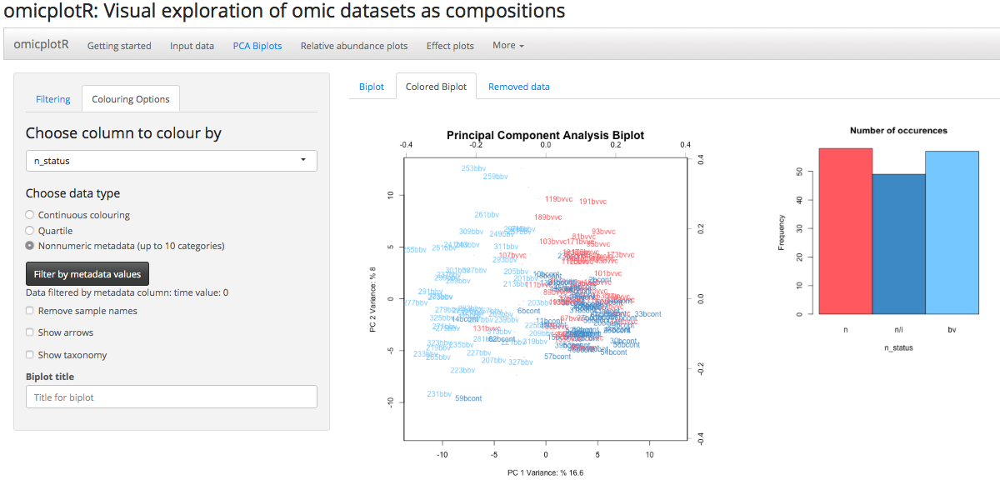
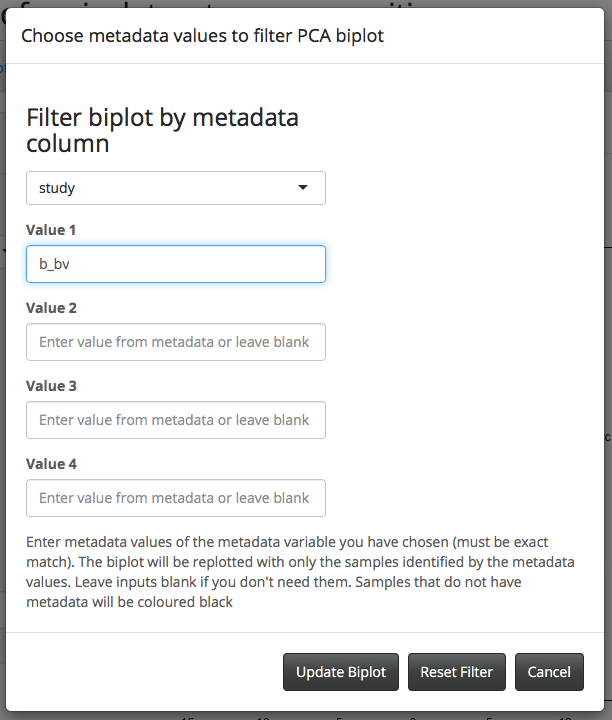
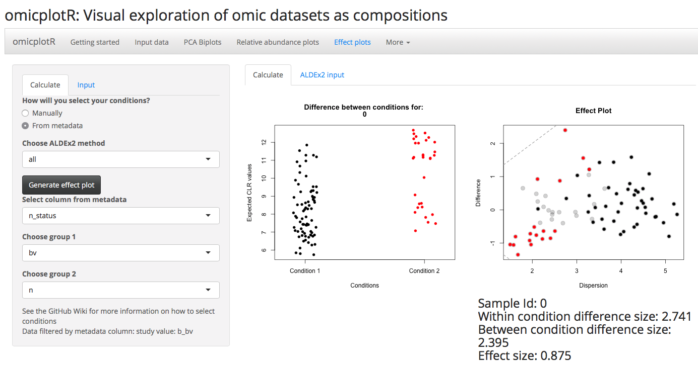

```{r global_options, include=FALSE}
#makes the figure position be held to its position in the text.
knitr::opts_chunk$set(fig.pos = "h")
```

# What is omicplotR?

`omicplotR` is an R package containing a `Shiny` app used to visually explore omic datasets, where the input is a table of read counts from high-throughput sequencing runs. It integrates the `ALDEx2`[^1] package for compositional analysis of differential abundance. `omicplotR` is intended facilitate exploring high-throughput sequencing datasets by providing a graphical user interface for users with and without experience in R.

[^1]: Fernandes et al (2013) PLOS ONE https://doi.org/10.1371/journal.pone.0067019

# Introduction

High-throughput sequencing (HTS) instruments generate an amount of reads that is constrained by limitations of the sequencing instrument itself, and do not represent the absolute number of DNA molecules in a sample. For example, an Illumina NextSeq can deliver up to 400 million single-end reads, whereas an Illumina MiSeq2 can only deliver up to 15 million single-end reads[^2]. This type of data, which is constrained by an arbitrary or constant sum, is referred to as compositional data, and high-throughput sequencing data must be treated as such[^3]. See `ALDEx2` for more information.

Although several R packages exist for exploring high-throughput sequencing data, they are typically command line based, which presents a barrier for users without any significant command line or scripting experience. `omicplotR` was created to facilitate the exploratory phase of high-throughput sequencing data analysis allowing the generation of basic exploratory plots automatically with adjustable features and filters.

[^2]: https://www.illumina.com/systems/sequencing-platforms/nextseq/specifications.html
[^3]: Gloor et al (2017) Front. Microbiol. https://doi.org/10.3389/fmicb.2017.02224

This vignette provides an overview of the R package `omicplotR` and the input requirements. A tutorial for each component of the `Shiny` app is available on the wiki:  [https://github.com/dgiguer/omicplotR/wiki](https://github.com/dgiguer/omicplotR/wiki). `omicplotR` was developed for several types of HTS datasets including RNASeq, meta-RNASeq, and 16s rRNA gene sequencing, and in principle, can  be used for nearly any type of data generated by HTS that contains a tables of counts per feature for each sample.

# Features

`omicplotR` provides a graphical user interface using the `Shiny` package for the following visualizations for HTS data:

* Compositional Principal Component Analysis (PCA) biplots
* Dendrograms
* Stacked barplots of relative taxonomic abundance
* Compositional differential abundance analysis

Additional features include:

* Filtering count tables per sample or feature by counts
* Filtering data into groups using metadata to compare sub groups within the data
* Colour PCA biplots using metadata (continuously, by quartile, categorical)
* Generate effect plots between groups according to metadata using `ALDEx2`
* Interactive effect plots to visualize difference between and within groups
* Plot pre-calculated `ALDEx2` tables and colour points by rownames for large datasets

# Installation and example

Install the latest version of `omicplotR`. Make sure you have the newest version of R, `ALDEx2`, and other dependancies. `omicplotR` requires you to have at least R version 3.5. The most up to date version is available at www.github.com/dgiguer/omicplotr/, and is the dev branch.

First, load the `omicplotR` package. All other dependencies will be loaded automatically. This will launch the `Shiny` app in your default browser. For this vignette, we will be using the example data and metadata provided. Example data and metadata are accessible by `data(otu_table)` and `data(metadata)`. They are also available as .txt files in `~/omicplotR/shiny-app/`.

```{r, eval=FALSE}
library(omicplotR)
omicplotr.run()
```

After launching the `Shiny` app, click the 'Input data' tab to get started.

# Input data

The 'Data' tab on the sidebar panel allows you to choose your own data and metadata by clicking 'Browse'. To follow along with this vignette, please click the 'Example data' tab on the sidebar panel, and click the checkbox for the 'Vaginal dataset'. This dataset, which includes associated metadata, is from a study that characterized the changes in the vaginal microbiome following antibiotic and probiotic treatment by 16s rRNA gene sequencing[^4]. Return to the 'Data' tab on the sidebar panel to view the data and metadata by clicking 'Show data' and 'Show metadata'. The tabs on the main panel allow you to switch between displaying your data and metadata tables.

```{r, echo = FALSE, out.width='80%', fig.align='center', fig.cap="Figure 1: Screenshot of input data page. The 'Example data' tab on the sidebar panel provides access to the provided datasets within the Shiny app."}

```

## Data

When choosing your own data set, input requirements are as follows: for both metadata and data, each sample and feature name (operational taxonomic unit - OTU) **must be unique**. An example of an appropriately formatted data file is shown in Figure 2.

1. The data file must be a **tab delimited .txt** (this is an option when you click 'Save as' from Excel, or when writing to a table in R).
2. The first column must contain feature/OTU identifiers. In this case, they are labelled as numbers.
3. The first row must contain sample identifiers.
4. The last column may contain taxonomic level information, but is not required. If present, it must be labelled exactly 'taxonomy'. **The taxonomy column must have at least four levels, separated by a semi colon or colon.**
5. Data table must have all blank rows removed (this may require you to check in a text editor like Notepad ++ or Atom before using the app). This should be especially checked if you are using a Windows based computer, since they use different line feeds.

```{r, echo = FALSE, out.width='80%', fig.align='center', fig.cap="Figure 2: Example data. If taxonomy column is present, it must use the column name 'taxonomy'. Image taken from modified version of Vaginal dataset."}
knitr::include_graphics("./example_data.png")
```

Your metadata file must follow a similar format. An example of an appropriate metadata file is shown in Figure 3.

1. Must be a **tab delimited .txt** (this is an option when you click 'Save as' from Excel).
2. The first column must contain sample identifiers. The sample identifiers must be identical to the data file, however, they are not required to be in the same order.
3. The first row must contain phenotypic information, or descriptions of each variable.

```{r, echo = FALSE, out.width='70%', fig.align='center', fig.cap="Figure 3: Example metadata file. Metadata maybe be numerical or categorical. Any blank spaces will be replaced as NA when importing the file. Any values of T or F will be read as TRUE or FALSE. Image taken from modified version of Vaginal dataset."}
knitr::include_graphics("./example_metadata.png")
```

## Example Data

The 'Example data' tab on the sidebar panel provides access to two example datasets. We will be using the provided 'Vaginal dataset', which contains both an OTU table and associated metadata. The 'Selex dataset' is from a selective growth experiment giving the differential abundance of 1600 enzyme variants[^5]. After selecting the 'Vaginal dataset', return to the 'Data' tab to and click 'Show data' to view the data. You can view the metadata by clicking 'Show metadata' and switching the tab in the main panel to 'Metadata'. Click the 'PCA Biplots' main tab to proceed.

[^4]: Macklaim et al (2015) Microb. Ecol. Heal. Dis. https://doi.org/10.3402/mehd.v26.27799.
[^5]: McMurrough et al (2014) PNAS doi:10.1073/pnas.1322352111

# PCA Biplots

The 'Filtering' tab within the sidebar panel allows you to choose filtering options for your dataset. Colouring options for a coloured PCA biplot are available under the 'Colouring options' tab. The tabs within the main panel allow you to switch between displaying a biplot under 'Biplot', a biplot coloured by metadata under 'Coloured Biplot', and visualizations of the removed samples/features from filtering under the 'Removed data' tab.

```{r, echo = FALSE, fig.align='center', fig.cap="Figure 4: Screenshot of coloured PCA biplot."}

```

## Filtering

"Reasonable" filtering of sparse features (rows) from your dataset **should not** affect any conclusions made from the PCA biplots. Filtering is exploratory, and should be experimented with to see how removing sparse data affects the structure of your dataset within the PCA biplot. By default, no filtering is applied. We will use a minimum count per OTU filter of 10 for this vignette.

Under the 'Filtering' tab within the sidebar panel, the following options are available to filter your data.

1. **Minimum count per OTU**
This filter removes any rows with a maximum sample count less than the input. It is recommended to remove sparse features. Try setting this filter to 10.

2. **Minimum count sum per sample**
This filter removes any columns that have a lower sum of counts than the filter. You can visualize which samples are being removed when applying this filter using the 'Filtering by counts per sample' graph under the 'Removed data' tab.

3. **Minimum proportional abundance**
This filter calculates frequency for each sample (by column) after filters 1 and 2 are applied, and removes any rows that have all frequencies below the threshold.

4. **Maximum proportional abundance**
This filter calculates frequency for each sample, and removes any rows that have no frequencies below the threshold.

5. **Minimum count sum per OTU**
This filter removes any rows that have a lower sum of counts than the filter. You can visualize which rows are removed with the 'Filtering by counts per row' graph under the 'Removed data' tab.

6. **Variance cutoff**
This filter calculates the variance for each OTU (row), and removes any rows that have lower variance than the filter. Variance is calculated after all other filters, and after the reads have been transformed by the centre-log ratio.

7. **Adjust scale**
This changes the scale of the biplot. When set to zero, it shows the relationship between samples (columns), while being set to 1 shows the relationship between OTUs (rows). Data is not filtered from this operation.

## Colouring options

To view the coloured PCA biplot, click the 'Coloured Biplot' tab within the main panel. Clicking the 'Colouring options' panel within the side bar panel allows you to choose which metadata to colour your plot by. We will be colouring the samples based on whether or not they were positive for bacterial vaginosis as defined by Nugent status. Choose the column 'n_status' to colour the data by Nugent status. You will need to click the 'nonnumeric metadata' radio button since the values of the column are categorical. The sample names that are black (ie, 128bvvc) on the PCA biplot represent samples without metadata.

### Filter by metadata

Under the 'Colouring options' tab in the sidebar panel, click on 'Filter by metadata values' to replot samples belonging to certain groups according to the metadata. This will generate a pop-up (Figure 5). Filter the dataset to replot only the samples at time zero by selecting the 'time' column, and inputting '0' into the text field for Value 1. This should update the coloured PCA biplot to show samples that were taken from time = 0. Click 'Update Filter' to update the filter, or 'Reset Filter' to reset it. **This filter is applied to the data for all other plots (relative abundance, effect plots).**

```{r, echo = FALSE, fig.align='center', out.width='50%', fig.cap="Figure 5: Pop-up generated from clicking 'Filter by metadata values'. Select a column and enter values from the column to re-plot only those values. They must match exactly. The filter can be reset or updated."}

```

# Relative abundance plots

Click the 'Relative abundance plots' main tab to continue. The sidebar panel allows you to filter the data by choosing an abundance cutoff, select the clustering method, and select the distance matrix method. The main panel displays a dendrogram above a stacked barplot, and both can be zoomed in by dragging your mouse over a selected region and double clicking.

Any filtering by metadata will be reflected in the dendrogram and stacked barplot as well.

# Effect plots

To generate effect plots, click on the 'Effect plots' main tab. Here, you can choose to calculate the `ALDEx2` table manually (ie, choosing which columns to compare) or by using metadata. For this example, we will use the included metadata to compare samples that were positive for bacterial vaginosis or not according to Nugent status. More information on choosing manually for your own data set is available on the GitHub wiki.

Click on the 'From metadata' radio button since we are selecting conditions using our metadata. Select the 'n_status' column from metadata. For Group 1 choose 'bv', and for Group 2 choose 'n'. After these have been selected, click the 'Generate effect plot' button. An effect plot and Bland-Altman plot will be generated. For large datasets, this will take a long time. It takes about 10 seconds for the example data, which has 77 features for 297 samples.

By hovering your cursor over a point on the effect plot, a stripchart of the expected CLR abundance (see `ALDEx2`) for each sample will be shown, allowing you to compare the differences between your samples for a given feature (Figure 6). It also displays information from the effect table generated by `ALDEx2`, such as the effect size, median difference between groups, and median difference within groups.

```{r, echo = FALSE, fig.align='center', fig.cap="Figure 6: Screenshot of effect plots. Hovering over a feature's point in the effect plot generates a stripchart to compare the relative abundances calculated by ALDEx2 for each sample."}

```

If you are using your own data and want to select groups by columns, you will need to reorder your file to have the first *n* columns as group 1, and the last *n* columns as group 2.

When running `omicplotR`, your R console will be be unavailable. To quit the app, click the 'More' main tab and click 'Quit omicplotR'. Alternatively, you can click `command` `.` on Mac.

# Contributors

Daniel J Giguere wrote the original `omicplotR` code and designed the `Shiny` app, with help from Brandon Lieng, Jean Macklaim, and Greg Gloor. Brandon Lieng wrote the function `clr.strip()` needed for the strip charts. Jean Macklaim conceptualized this project, contributed ideas for the design, and wrote the original code for the taxonomic distribution and dendrograms. Greg contributed ideas for features, and played a role in designing and implementing `omicplotR`.

# Version information

Currently version 0.99.4.

For more information about how to use `omicplotR`, please visit the wiki on my Github page:

[https://github.com/dgiguer/omicplotR/wiki](https://github.com/dgiguer/omicplotR/wiki)
